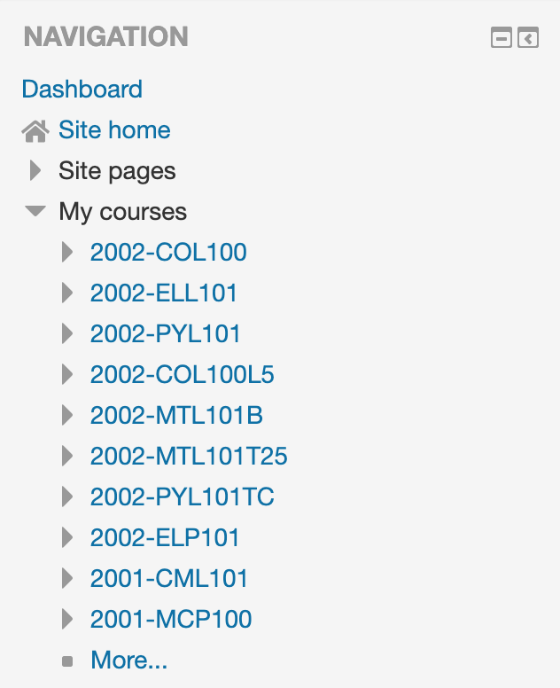

# Moodle Sidebar Plugin

Reduces the clicks required to access a particular course (and frustration 
as well :)

This is a small utility plugin that puts the links of the other courses you 
have taken into the moodle sidebar for easy navigation.

### Features

* The plugin will only fill the courses the student is taking in the current sem.
  The first time the plugin is launched, it will take some time to find and 
  store the set of courses the student is taking and will reload 
  the page once automatically. After this, it should work as intended.
  This also works for Batch A people now :)
* Auto-updating: to update your course list with the plugin, go to your profile
  and click 'view more' under the courses section. The plugin will update the 
  course database. This is independent of semester and should work across all 
  semesters
* The navigation arrows will not work on the sidebar after this plugin is installed.
  This is just replacing links, and for actually navigating the course, use the
  main view or the tree view further down the sidebar

### Contributing

* Clone and send pull requests if you have any features to add or bugs to fix!
* Having a fork is also cool! one nice fork  
  [can be found here](https://github.com/fricai/MoodleSidebarPlugin)

### Installation

1. Clone the git repo
2. Switch on 'developer mode' in Chrome Extensions
3. Load the unpacked extension

### Updating

1. Go to the location where you've cloned the repo
2. `git pull` to sync changes
3. Go to chrome and reload the extension
